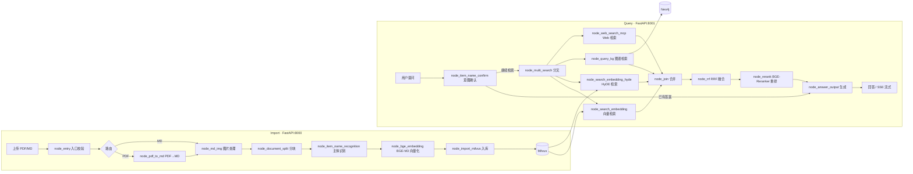

# 掌柜智库（Zhangui Zhiku）— RAG 智能知识库问答系统

一个基于 **RAG（检索增强生成）** 架构的智能知识库问答系统，围绕「知识库导入（写入）」与「智能问答（读取）」两条业务主线构建。系统使用 **LangGraph 状态图** 编排核心流程，以 **FastAPI** 对外提供 HTTP 服务，支持产品手册、使用说明书等 PDF / Markdown 文档的批量导入与基于产品型号的智能问答。

## ✨ 功能特性

### 知识库导入（写入链路）
- 支持 **PDF / Markdown** 文档批量上传，后台异步处理，前端实时查看任务进度
- **PDF 解析**：通过 MinerU（在线 API）+ Magic-PDF 将 PDF 转为 Markdown
- **图片处理**：提取 / 下载文档内图片，修复图片路径使其可访问
- **智能分块**：支持普通切分、高级切分等多种切分策略
- **业务主体识别**：自动识别文档对应的产品型号 / 实体名称（业务定制化步骤）
- **向量化入库**：使用 **BGE-M3** 生成向量，写入 **Milvus** 向量数据库

### 智能问答（读取链路）
- **商品 / 型号意图确认**：内置「多选一反问」「无法确认即拒答」等处理策略
- **四路并行检索**：
  - 向量检索（Milvus + BGE-M3）
  - HyDE 增强向量检索
  - 知识图谱检索（Neo4j，可选）
  - Web 搜索（DashScope MCP）
- **结果融合**：RRF（Reciprocal Rank Fusion）多路结果融合 + **BGE-Reranker** 重排序
- **回答生成**：基于通义千问（qwen-flash）生成答案，支持 **SSE 流式** 实时推送
- **会话管理**：历史记录持久化到 **MongoDB**，支持查询 / 清空

### 其他
- 原生 HTML 前端页面：文件导入页 `import.html`、对话页 `chat.html`
- 基于 **loguru** 的统一日志系统，支持控制台 / 文件双通道、级别与保留天数可配
- 提示词与代码解耦：全部模板存放于 `prompts/*.prompt`

## 🏗️ 系统架构

两条业务主线均以 LangGraph 状态图驱动，外部通过两个 FastAPI 服务暴露接口：



## 🧰 技术栈

| 类别 | 技术 |
| --- | --- |
| 语言 / 运行时 | Python 3.11+，依赖管理 [uv](https://docs.astral.sh/uv/) |
| 框架 | FastAPI、Uvicorn、LangGraph、LangChain |
| 模型服务 | 阿里云百炼 DashScope（qwen-flash / qwen3-vl-flash）、BGE-M3（Embedding）、BGE-Reranker-Large（重排） |
| PDF 解析 | MinerU（在线 API）、Magic-PDF |
| 向量数据库 | Milvus（集合：`kb_chunks` / `kb_item_names`） |
| 知识图谱 | Neo4j（可选，社区版） |
| 对象存储 | MinIO（文件与图片持久化） |
| 会话存储 | MongoDB |
| 其他 | PyTorch、ModelScope（模型下载）、loguru（日志） |

## 📁 目录结构

```
PythonProject16/
├── .env                        # 环境配置（含密钥，已 gitignore，见 .env.example）
├── pyproject.toml              # uv 项目声明与依赖清单
├── uv.lock                     # uv 依赖锁定文件
├── prompts/                    # 6 个 .prompt 提示词模板（与代码解耦）
├── app/
│   ├── clients/                # 外部基础设施客户端（Milvus / MinIO / MongoDB / Neo4j 单例封装）
│   ├── conf/                   # 配置层（dataclass 从 .env 读取）
│   ├── core/                   # 统一日志（logger）+ 提示词加载（load_prompt）
│   ├── lm/                     # 大模型 / Embedding / Reranker 封装
│   ├── import_process/         # 【导入链路】LangGraph 图 + FastAPI 服务 + import.html 页面
│   │   ├── agent/              #   状态定义、main_graph 图编排、nodes/ 各业务节点
│   │   ├── api/                #   file_import_service.py（FastAPI:8000）
│   │   └── page/               #   导入前端页面
│   ├── query_process/          # 【查询链路】LangGraph 图 + FastAPI 服务 + chat.html 页面
│   │   ├── agent/              #   状态定义、main_graph 图编排、nodes/ 各业务节点
│   │   ├── api/                #   query_service.py（FastAPI:8001）
│   │   └── page/               #   对话前端页面
│   ├── tool/                   # 模型下载一次性脚本（download_bgem3 / download_reranker）
│   └── utils/                  # 通用工具（SSE、任务管理、路径、格式化、限流等）
└── test/                       # 5 个手工测试脚本（非 pytest 框架）
```

> 未纳入版本控制（详见 .gitignore）：`.env`（含密钥）、`doc/`（原始手册 PDF，体积过大）、`output/`（解析产物）、`logs/`（日志）、`temp-files/`（临时文件）、`学习/`（学习笔记，不对外发布）。

## 🚀 快速开始

### 环境要求

- **Python 3.11+**，推荐使用 [uv](https://docs.astral.sh/uv/)
- 需要可访问的外部服务：**Milvus**、**MongoDB**、**MinIO**，可选 **Neo4j**
- 阿里云百炼 DashScope **API Key**（LLM 与 MCP Web 搜索）
- **MinerU API Token**（PDF 解析在线服务）

### 1. 安装依赖

```bash
# 使用 uv（推荐）
uv sync

# 或使用 pip
pip install -e .
```

### 2. 配置环境变量

复制模板并填入你的实际配置：

```bash
cp .env.example .env
```

> ⚠️ `.env` 中包括 `OPENAI_API_KEY`（DashScope）、`MINERU_API_TOKEN`、`NEO4J_PASSWORD`、MinIO 密钥等敏感信息，请勿提交到 Git。仓库已通过 `.gitignore` 将其排除。

### 3. 启动服务

分别启动导入服务与查询服务：

```bash
# 导入服务（默认端口 8000）—— 文件上传 / 知识库导入
python app/import_process/api/file_import_service.py

# 查询服务（默认端口 8001）—— 智能问答
python app/query_process/api/query_service.py
```

启动后访问：
- 导入页：<http://127.0.0.1:8000/import.html>
- 对话页：<http://127.0.0.1:8001/chat.html>
- Swagger 文档：<http://127.0.0.1:8000/docs> 与 <http://127.0.0.1:8001/docs>

## 🔌 API 接口

### 导入服务（端口 8000）

| 方法 | 路径 | 说明 |
| --- | --- | --- |
| GET | `/import.html` | 文件导入前端页面 |
| POST | `/upload` | 多文件上传，自动触发知识库导入全流程，返回 `task_ids` |
| GET | `/status/{task_id}` | 查询单个导入任务的状态与已完成节点（供前端轮询） |

### 查询服务（端口 8001）

| 方法 | 路径 | 说明 |
| --- | --- | --- |
| GET | `/chat.html` | 对话前端页面 |
| GET | `/health` | 健康检查 |
| POST | `/query` | 发起问答，`is_stream` 控制是否流式返回 |
| GET | `/stream/{session_id}` | SSE 流式结果推送 |
| GET | `/history/{session_id}` | 查询会话历史（默认最近 50 条） |
| DELETE | `/history/{session_id}` | 清空指定会话历史 |

## ⚙️ 配置说明（.env）

核心配置项如下，完整字段见 `.env.example`：

| 分组 | 字段 | 说明 |
| --- | --- | --- |
| LLM | `LLM_DEFAULT_MODEL` / `VL_MODEL` | 默认对话模型与视觉模型（阿里云百炼） |
| LLM | `OPENAI_API_KEY` / `OPENAI_BASE_URL` | DashScope 兼容 OpenAI 接口的密钥与地址 |
| Embedding | `BGE_M3_PATH` / `BGE_DEVICE` / `BGE_FP16` | BGE-M3 本地模型路径与运行设备 |
| Reranker | `BGE_RERANKER_LARGE` / `BGE_RERANKER_DEVICE` | 重排模型路径与运行设备 |
| 向量库 | `MILVUS_URL` / `CHUNKS_COLLECTION` / `ITEM_NAME_COLLECTION` | Milvus 地址与集合名（向量维度 1024） |
| 知识图谱 | `NEO4J_URI` / `NEO4J_USERNAME` / `NEO4J_PASSWORD` | Neo4j 连接信息（可选） |
| 会话存储 | `MONGO_URL` / `MONGO_DB_NAME` | MongoDB 连接信息 |
| 对象存储 | `MINIO_ENDPOINT` / `MINIO_ACCESS_KEY` / `MINIO_SECRET_KEY` / `MINIO_BUCKET_NAME` | MinIO 连接信息 |
| PDF 解析 | `MINERU_API_TOKEN` / `MINERU_BASE_URL` | MinerU 在线解析服务凭据 |
| Web 搜索 | `MCP_DASHSCOPE_BASE_URL` | 百炼 MCP（WebSearch）SSE 地址 |
| 日志 | `LOG_CONSOLE_*` / `LOG_FILE_*` / `LOG_FILE_RETENTION` | 日志开关、级别与保留天数 |

## 🧠 核心工作流说明

### 导入链路节点顺序

`node_entry`（入口校验）→ `node_pdf_to_md`（PDF→MD，PDF 路径）/ `node_md_img`（图片处理，MD 直读路径）→ `node_document_split`（分块）→ `node_item_name_recognition`（主体识别）→ `node_bge_embedding`（向量化）→ `node_import_milvus`（入库）→ 结束。

### 查询链路节点顺序

`node_item_name_confirm`（意图确认，可触发反问 / 拒答直接出结果）→ `node_multi_search`（四路并行分叉：向量 / HyDE / 图谱 / Web）→ `node_join`（合并）→ `node_rrf`（融合）→ `node_rerank`（重排）→ `node_answer_output`（生成答案）。

## ⚠️ 注意事项

- **密钥安全**：`.env` 含真实 API Key / Token / 密码，已通过 `.gitignore` 排除，仅提交 `.env.example` 模板。
- **大文件不入库**：`doc/` 存放知识库原始手册（约 700MB），超出 GitHub 推荐限制，未纳入版本控制；如需他人共享数据，请通过其他方式分发。
- **依赖安装**：`torch`、`transformers`、`flagembedding` 等依赖体积较大，首次安装耗时较长。
- **模型下载**：BGE-M3 与 BGE-Reranker 需提前下载到本地（参考 `app/tool/` 下脚本），或在 `.env` 中配置缓存目录。

## 📄 License

本项目为内部业务项目，暂未指定开源许可证，如需对外发布请先与项目所有者确认。
